# Introduction

When it comes to cloud computing, one of the most ubiquitous names is Microsoft's cloud platform, Azure. In this lab, I set out to get a better understanding of Azure and how it is used to provide security solutions. To do so, I will be creating a virtual machine on Azure that has port 3389 open. 

For background, port 3389 serves the Remote Desktop Protocol or RDP which allows users to remote into a computer and control it from their own machine. While this is convenient for team members and those who are authorized to use the computer, this is also a glaring security vulnerability. All an attacker needs to breach a machine with RDP enabled is the machine's public IP address and its credentials. This vulnerability is so bad, that I have even heard that enabling RDP on a crucial machine is a fireable offense! This threat is only catalyzed if the user implemented a weak password for the machine. In our case, this is what we want because it gives us a chance to create a version of Azure's built-in Security Information and Event Management (SIEM) tool, Sentinel, and test it out.

There are two parts to this lab, but in this first part, the objective is to create an intentionally vulnerable virtual machine and use it to test the robustness and response efficacy of a SIEM tool I will configure.

# Setting Up Azure and the Virtual Machine

The entirety of this lab will be conducted using a trial version of Azure. To begin, I have to set up my account so I can start using Azure's services. I enter my information and am ready to get started.

Once I am taken to the homepage, it is now time to create my virtual machine. For this lab, I will be creating a virtual machine with a preset configuration.

- _Figure 1_: The "create" menu for Azure's virtual machine. As mentioned, I will be selecting the option to create an Azure VM with preset configuration.

  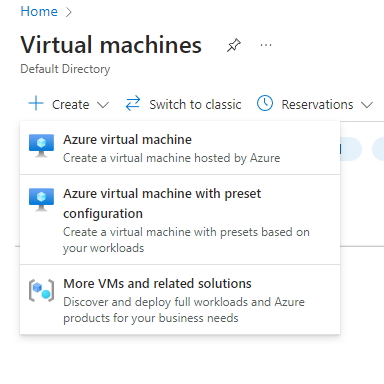

The next step is to configure the recommended defaults for my VM. I will be going with the Production workload environment and the General Purpose (D-series) workload type. This is the standard, basic format of an Azure VM which is just what I need. This will then take me to the virtual machine creation portal.

Before I can start configuring my virtual machine, the first thing I need is a name for my resource group. This resource group will act as the container for all the things I will be creating. Being as creative as I am, I opted to go with the name, MattGroup. Therefore, my VM, SIEM, and threat intelligence feed will all answer to MattGroup. 

The next step is to fill out the instance details. For the virtual machine name, I let my creativity shine once again and go for the name "MattsVM". Next is the region. Interestingly, I have found that Azure only offers its free services to regions where their cloud computing services are in low demand. There were no services available in the United States, so that makes me Australian now, mate. As for the security type, I will be sticking with trusted launch. Lastly, for my image, I will be using a x64 bit version of Windows 11 Pro.

-_Figure 2_: The instance details of my virtual machine. Notice that my region is set in East Australia and that I will be running a version of Windows 11 Pro.

  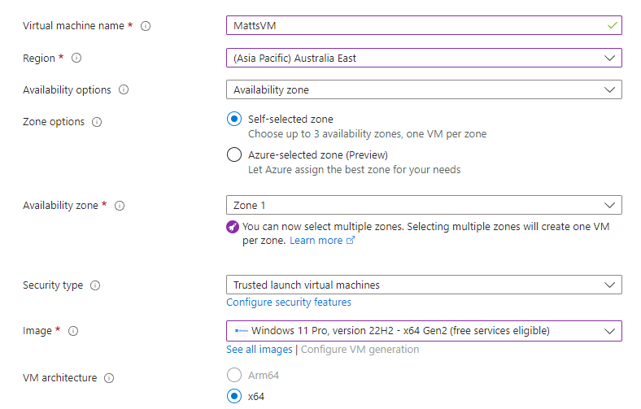

The next part is to set up my virtual machine's credentials. The username is "mattb", and the password, per Azure's requirements, is fairly robust. As a result, the password will be difficult to guess and brute force which I feel is a limitation to this lab. Although I can still make my virtual machine vulnerable, this is not quite the honeypot environment I was intending. Nevertheless, with this in place, I move on to the inbound port rules.

Per standard hardening procedures, you want to disable any inbound ports that are not necessary for the desired function of your machine. Usually, at the top of this list is RDP. In our case, however, we want to allow inbound RDP traffic. Therefore, we "allow selected ports" for our VM and specifically enable port 3389 for RDP.

- _Figure 3_: The inbound port rules panel. I have enabled inbound port traffic for this virtual machine, but only for RDP.

  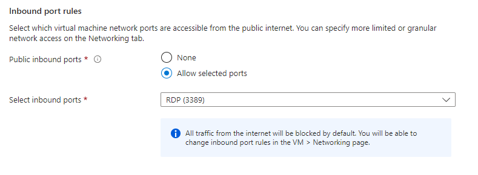

These are the only noteworthy settings for my virtual machine. The rest of the settings are default, although I did find this notice in the network interface section interesting:

- _Figure 4_: The network interface section. Notice how even Azure warns me that enabling RDP for my machine is probably a bad idea.

  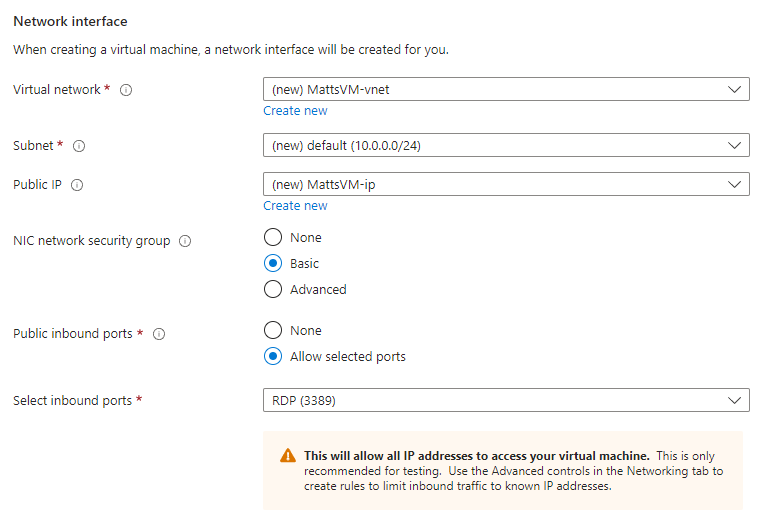

Aside from that, the other settings are default. We will not be needing network accelerating or load balancing for this lab, since this is only a single VM. With all settings in place, I am now ready to validate and create my virtual machine.

# Creating and Deploying Sentinel

The virtual machine will take time to create, which is perfect because now I can use that time to deploy Sentinel. Using the search bar, I navigate to Sentinel's page and get it started by clicking the "Create Microsoft Sentinel" button. I am absolutely delighted to see how user-friendly Azure is, and how simple it is to create my own instance of Sentinel.

The first thing I need to do is create a log analytics workspace. This is so I can give Sentinel something to read off of. As mentioned, my version of Sentinel will be associated with the MattGroup resource group. From there, I give the workspace the name "Mattb-LogAnalytics" and set up the region to be East Australia. It is important that the region of my virtual machine and log analytics workspace line up so that I can minimize response time as much as possible. If, for instance, I set my workspace to be in the Western United States, but still have my VM's region as East Australia, there can be some serious lag time between when the event occurred, and when it was actually recorded.

- _Figure 5_: The project details of my workspace creation page. I have associated this space with MattGroup and given it the region of East Australia. Also, I have not set up MFA for this workspace.

  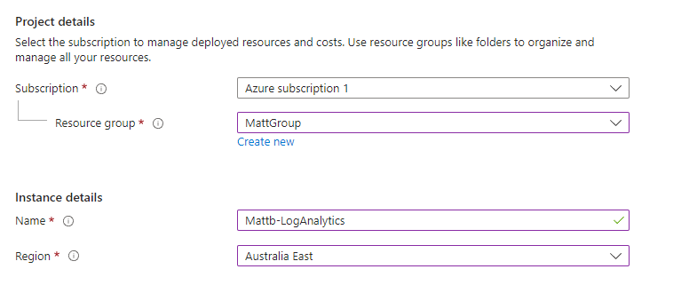

With my parameters in place. I hit "Review + Create" and my workspace is created. The next step is to add Sentinel to my log analytics workspace. This is done by simply clicking the newly created workspace in the directory.

# Putting It All Together

At this point, I have a running virtual machine, an instance of Sentinel, and a log analytics workspace. Now I just need to put it all together so I can start gathering my data. I have already paired the workspace with Sentinel, so now the next step is to take the event logs of my virtual machine and send them to the log analytics workspace.

- _Figure 6_: The "agents" panel of my Windows virtual machine. Currently, it says there are zero Windows computers connected. This is a problem because there are all these events my VM is logging, but it has nowhere to send these logs.

  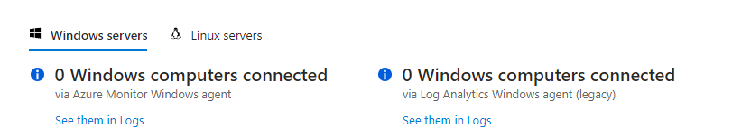

Each of these components has data to share, but no way to share it with each other. Therefore, we need to connect the data with a...Data connector. First I need to get one. I navigate to the content hub to view the known data connectors approved for use in Azure. For this lab, I will be using Windows Security Events via Azure Monitor Agent.

- _Figure 7_: The Windows Security Events data connector information panel. As you can see, the function of this data connector is to ingest events in my virtual machine to my log analytics workspace and, by proxy, Sentinel.

  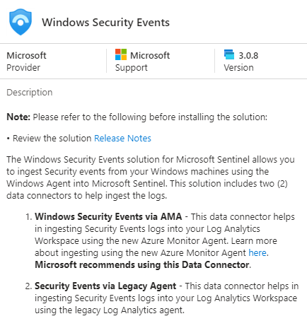

After my data connector has installed, I head to my data connectors menu and refresh. I am then greeted with two possible connectors.

- _Figure 8_: My available data connectors in the data connector menu. Notice that there is a current version and a legacy version.

  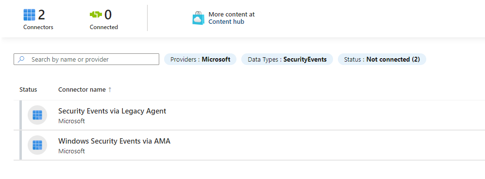

I have no reason to use the legacy version, and in cyber security, it is important to always stay up to date. Therefore, I will be running with the most recent version of Windows Security Events. With my selection made, I open the data connector and set up my data collection rule. I will be naming this "WindowsEventstoSentinel".

- _Figure 9_: The rule details page for my data collection rule. I have set the name and associated this rule with my resource group.

  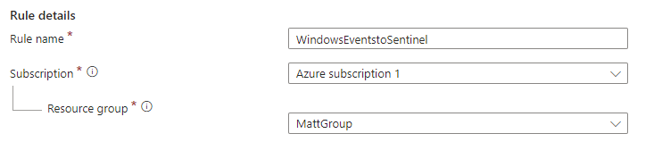

I will now select the resources from which to collect data. I select my virtual machine which, in turn, selects everything above it in the hierarchy.

- _Figure 10_: The resources tab for the data collection rule creation. Notice that everything is selected, so data will be ingested from my virtual machine and anything else that is associated with my resource group.

  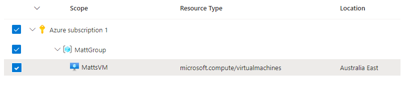

I then configure the rule so that the data collection records all security events, then finalize my selection. The data connector is now created.

- _Figure 11_: The resulting screen for my data connector after creating the data collection rule. Notice how, immediately after its implementation, it is already gathering data.

  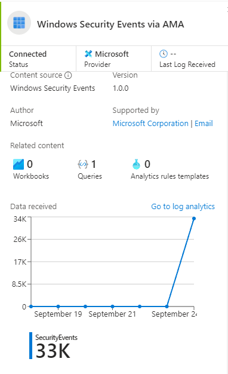

With these steps completed, my data is connected and my components are working in total harmony. My virtual machine is sending its logs via the data connector to my log analytics workspace to then be evaluated by Sentinel.

# Creating the Rule for Sentinel

At this point, I have set up my virtual machine and it is ready to be experimented on and monitored. This monitoring will be done by my instance of Sentinel. Sentinel gathers data and generates alerts based off the rules you give it. I will be creating my rules by first creating queries to view the data I want to see. The objective here is to create a rule that checks for successful sign ins via RDP. If that criteria is met, an incident should be created.

The first thing I want to do is play around with the search queries and refine it so I find exactly what I want. To begin, I know I want Sentinel to view instances where there were successful logins. Therefore, I want to filter out my logs so that any activity on the virtual machine involving the work "success" is logged. Like so:

- _Figure 12_: The first search query for logs through Sentinel. The query plainly states to view recorded security events where the activity section of the log contains the word "success". Though a bit vague, this is a generally effective way to view any instances of a successful login. Notice that there are already a couple of hits.

  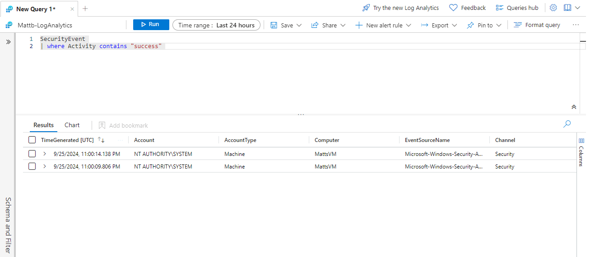

Although I have some results for this query, these are events that originated from the system, so they should be disregarded. Therefore, there is some additional refinement that needs to happen. Luckily, Azure's "not" (!) operator should come in handy to filter out any instances of successful logins pertaining to the system.

- _Figure 13_: My refined query. This time, the query tells Sentinel to view all security event logs where the word "success" appears in the activity, but the originating account does not contain the word "system". This should be sufficient for filtering out any security event logs coming from the system.

  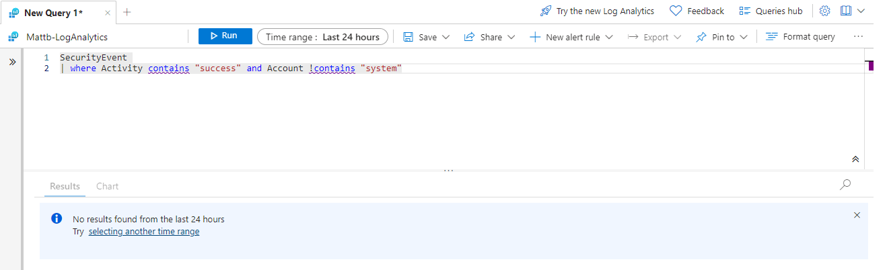

Now with this query in place, I no longer get any results. This is a good thing, as it implies that my two results involving the system have been filtered out. I also find it highly unlikely my VM has already been breached, so I must therefore conclude that there simply are not any results yet. Satisfied, I can use my query to create a new rule for Sentinel.

- _Figure 14_: The creation of the new Sentinel rule. I am giving it the name "Successful Local Sign Ins" with a severity of "medium". I also configure it so that it only registers "initial access". This means that the incident will only be recorded if it is a user's first time signing on to the virtual machine.

  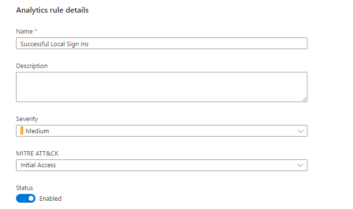

From there, I can now get into the specifics of my new rule. I now navigate to the "query scheduling" section of Sentinel's rule creation page. I have it set so that Sentinel runs the query every five minutes and looks up data from the last five minutes. I believe that these should be regular enough to capture the activity I want to see.

Next is the alert threshold. Personally, I believe one successful, unauthorized sign in is one too many. Therefore, the alert should be generated anytime the query results are greater than zero.

- _Figure 15_: The "query scheduling" and "alert threshold" sections of the rule creation page. I have it set so that Sentinel runs the query every five minutes and looks up data from the last five minutes, and alerts are generated if even a single result appears. I also have it so all events are grouped into a single alert.

  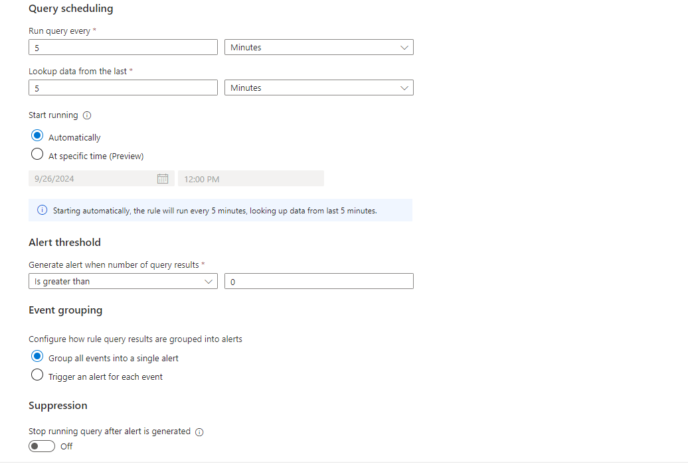

