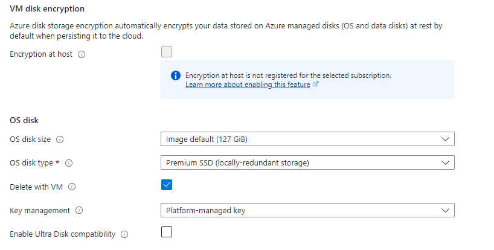

# Introduction

When it comes to cloud computing, one of the most ubiquitous names is Microsoft's cloud platform, Azure. In this lab, I set out to get a better understanding of Azure and how it is used to provide security solutions. To do so, I will be creating a virtual machine on Azure that has port 3389 open. 

For background, port 3389 serves the Remote Desktop Protocol or RDP which allows users to remote into a computer and control it from their own machine. While this is convenient for team members and those who are authorized to use the computer, this is also a glaring security vulnerability. All an attacker needs to breach a machine with RDP enabled is the machine's public IP address and its credentials. This vulnerability is so bad, that I have even heard that enabling RDP on a crucial machine is a fireable offense! This threat is only catalyzed if the user implemented a weak password for the machine. In our case, this is what we want because it gives us a chance to create a version of Azure's built-in Security Information and Event Management (SIEM) tool, Sentinel, and test it out.

There are two parts to this lab, but in this first part, the objective is to create an intentionally vulnerable virtual machine and use it to test the robustness and response efficacy of a SIEM tool I will configure.

# Setting Up Azure and the Virtual Machine

The entirety of this lab will be conducted using a trial version of Azure. To begin, I have to set up my account so I can start using Azure's services. I enter my information and am ready to get started.

Once I am taken to the homepage, it is now time to create my virtual machine. For this lab, I will be creating a virtual machine with a preset configuration.

- _Figure 1_: The "create" menu for Azure's virtual machine. As mentioned, I will be selecting the option to create an Azure VM with preset configuration.

  

The next step is to configure the recommended defaults for my VM. I will be going with the Production workload environment and the General Purpose (D-series) workload type. This is the standard, basic format of an Azure VM which is just what I need. This will then take me to the virtual machine creation portal.

Before I can start configuring my virtual machine, the first thing I need is a name for my resource group. This resource group will act as the container for all the things I will be creating. Being as creative as I am, I opted to go with the name, MattGroup. Therefore, my VM, SIEM, and threat intelligence feed will all answer to MattGroup. 

The next step is to fill out the instance details. For the virtual machine name, I let my creativity shine once again and go for the name "MattsVM". Next is the region. Interestingly, I have found that Azure only offers its free services to regions where their cloud computing services are in low demand. There were no services available in the United States, so that makes me Australian now, mate. As for the security type, I will be sticking with trusted launch. Lastly, for my image, I will be using a x64 bit version of Windows 11 Pro.

-_Figure 2_: The instance details of my virtual machine. Notice that my region is set in East Australia and that I will be running a version of Windows 11 Pro.

  

The next part is to set up my virtual machine's credentials. The username is "mattb", and the password, per Azure's requirements, is fairly robust. As a result, the password will be difficult to guess and brute force which I feel is a limitation to this lab. Although I can still make my virtual machine vulnerable, this is not quite the honeypot environment I was intending. Nevertheless, with this in place, I move on to the inbound port rules.

Per standard hardening procedures, you want to disable any inbound ports that are not necessary for the desired function of your machine. Usually, at the top of this list is RDP. In our case, however, we want to allow inbound RDP traffic. Therefore, we "allow selected ports" for our VM and specifically enable port 3389 for RDP.

- _Figure 3_: The inbound port rules panel. I have enabled inbound port traffic for this virtual machine, but only for RDP.

  

These are the only noteworthy settings for my virtual machine. The rest of the settings are default, although I did find this notice in the network interface section interesting:

- _Figure 4_: The network interface section. Notice how even Azure warns me that enabling RDP for my machine is probably a bad idea.

  

Aside from that, the other settings are default. We will not be needing network accelerating or load balancing for this lab, since this is only a single VM. With all settings in place, I am now ready to validate and create my virtual machine.

# Creating and Deploying Sentinel

The virtual machine will take time to create, which is perfect because now I can use that time to deploy Sentinel. Using the search bar, I navigate to Sentinel's page and get it started by clicking the "Create Microsoft Sentinel" button.
